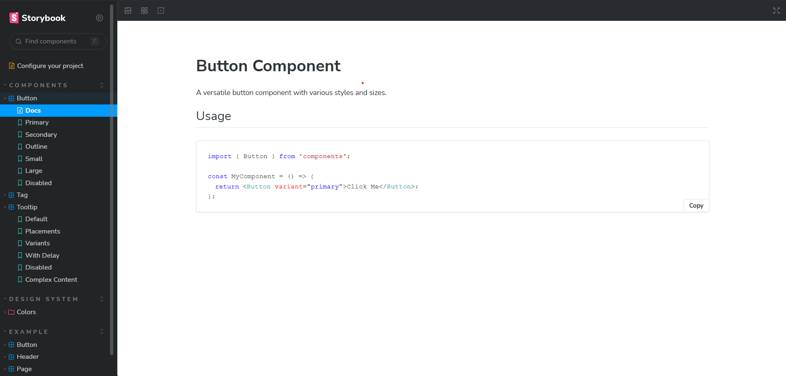

# Uzence Design System

A modern, accessible, and customizable design system built with React, TypeScript, and Tailwind CSS. This design system provides a comprehensive set of reusable components and design tokens to ensure consistency across applications.



## Features

- 🎨 **Comprehensive Component Library**
- 🎯 **TypeScript Support**
- 🎭 **Dark/Light Theme Support**
- ♿ **Accessibility First**
- 📱 **Responsive Design**
- 🧪 **Test Coverage**
- 📚 **Storybook Documentation**
- 🎨 **Tailwind CSS Integration**

## Installation

```bash
# Clone the repository
git clone https://github.com/Azman-Idrisi/Uzence-Storybook.git

# Install dependencies
npm install

# Start the development server
npm start
```

## Usage

### Basic Setup

```tsx
import { Button, ThemeProvider } from '@uzence/design-system';

function App() {
  return (
    <ThemeProvider>
      <Button variant="primary">Click me</Button>
    </ThemeProvider>
  );
}
```

### Available Scripts

- `npm start` - Runs the app in development mode
- `npm run storybook` - Launches Storybook
- `npm test` - Runs the test suite
- `npm run build` - Creates a production build
- `npm run build-storybook` - Builds the Storybook documentation

## Component Documentation

Explore our components in [Storybook](https://uzence-storybook.vercel.app/).

### Available Components

- Button
- Input
- Card
- Modal
- Tooltip
- Dropdown
- And more...

## Design Tokens

Our design system includes:

- **Colors**: Primary, secondary, accent, and semantic colors
- **Typography**: Font families, sizes, and weights
- **Spacing**: Consistent spacing scale
- **Shadows**: Elevation system
- **Border Radius**: Standardized corner radiuses
- **Breakpoints**: Responsive design breakpoints

## Contributing

We welcome contributions! Please read our [Contributing Guidelines](CONTRIBUTING.md) before submitting pull requests.

1. Fork the repository
2. Create your feature branch (`git checkout -b feature/amazing-feature`)
3. Commit your changes (`git commit -m 'Add some amazing feature'`)
4. Push to the branch (`git push origin feature/amazing-feature`)
5. Open a Pull Request

## Development

### Prerequisites

- Node.js (v18 or higher)
- npm (v9 or higher)

### Local Development

```bash
# Install dependencies
npm install

# Start Storybook
npm run storybook

# Run tests
npm test
```

## Testing

We use Jest and React Testing Library for our test suite. Run the following command to execute tests:

```bash
npm test
```

## Accessibility

Our components are built with accessibility in mind, following WCAG 2.1 guidelines. Each component includes:

- ARIA attributes
- Keyboard navigation
- Focus management
- Screen reader support

## Browser Support

- Chrome (latest)
- Firefox (latest)
- Safari (latest)
- Edge (latest)

## License

This project is licensed under the MIT License - see the [LICENSE](LICENSE) file for details.

## Acknowledgments

- [React](https://reactjs.org/)
- [TypeScript](https://www.typescriptlang.org/)
- [Tailwind CSS](https://tailwindcss.com/)
- [Storybook](https://storybook.js.org/)

## Contact

For any questions or support, please reach out to:
- Email: [your-email@example.com]
- GitHub: [@Azman-Idrisi](https://github.com/Azman-Idrisi)
